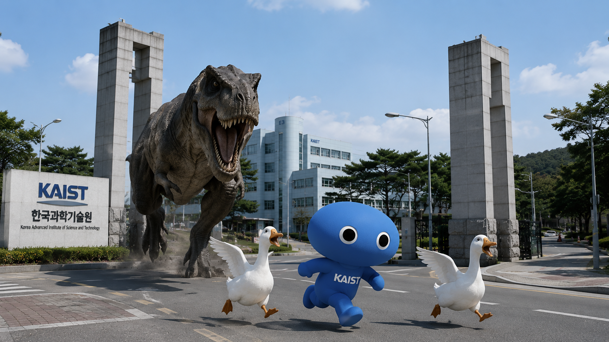
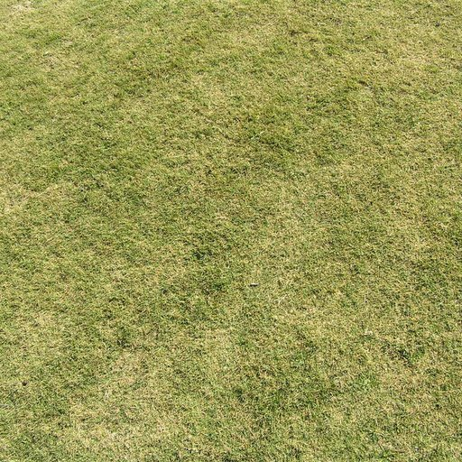
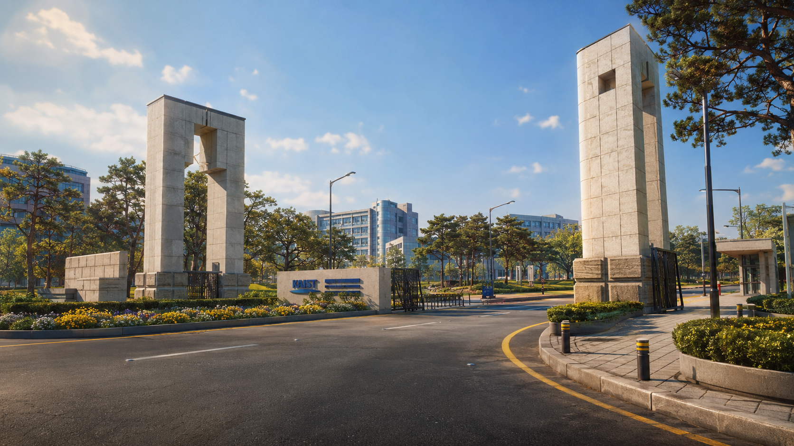
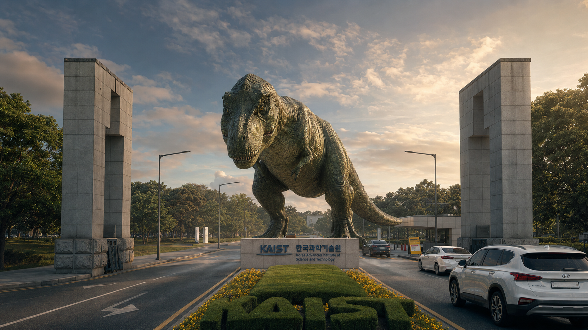
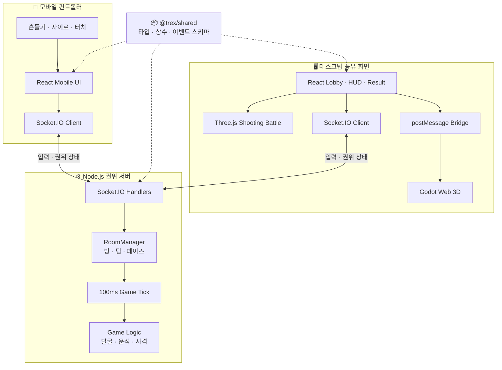

# 🙋🏻 팀원 소개

---

<aside>
🖥️

HYU 23 CSE

김혜리

https://github.com/ireyhye

</aside>

<aside>
🖥️

EWHA 23 CSE

김윤서

https://github.com/Westyoon

</aside>

# 📖 프로젝트 소개

---

> 휴대폰을 컨트롤러로 사용해 뼈를 발굴하고, 운석을 피하고, 티라노사우루스를 부활시키는 실시간 팀 대항 파티 게임

🖥️ Play on Web: https://t-rex-revival.madcamp-kaist.org/

# 🔭 기획 배경 및 모티브

---

### **🦖 모두가 아는 티라노사우루스의 재발견**

- 누구나 한눈에 이해할 수 있는 티라노사우루스와 화석 발굴을 소재로 사용했습니다.
- 6,600만 년 전 백악기 말에서 2026년 대한민국으로 이어지는 이야기를 통해 세 개의 미니게임을 하나의 부활 서사로 연결했습니다.
- 부활에 성공하더라도 플레이 결과에 따라 정상적인 티라노사우루스 또는 예상하지 못한 `와이라노사우루스`가 탄생하도록 해 실패도 재미있는 결과가 되게 했습니다.

### **📱 개인 휴대폰을 게임 컨트롤러로**

- 별도의 앱이나 전용 장비 없이 QR 코드만 스캔하면 자신의 휴대폰이 즉시 컨트롤러가 됩니다.
- 흔들기, 터치, 자이로, 진동 등 모바일 웹에서 사용할 수 있는 센서를 게임 입력과 피드백으로 활용했습니다.
- 여러 사람이 각자의 화면을 조작하면서도 하나의 데스크탑 화면을 함께 바라보는 오프라인 파티 게임 경험을 지향했습니다.

### **🤝 경쟁보다 먼저 보이는 협동**

- 두 팀이 경쟁하지만 각 게임은 팀원 모두의 입력과 점수를 합쳐 진행됩니다.
- 발굴 목표는 인원수에 맞게 조절하고, 운석 게임의 생명과 사격 점수는 플레이어별로 관리해 팀 내 역할과 기여가 드러나도록 설계했습니다.
- 먼저 끝난 팀도 상대 팀의 진행을 함께 지켜보고, 탈락한 플레이어는 남은 팀원을 응원할 수 있도록 전체 흐름을 구성했습니다.

# ✨ 주요 특징

---

#### **📷 무가입 QR 멀티플레이**

- 데스크탑에서 방을 만들면 4자리 입장 코드와 QR 코드가 생성됩니다.
- 플레이어는 회원가입이나 앱 설치 없이 닉네임만 입력해 참가할 수 있습니다.
- 참가자는 두 팀에 자동 배정되고, 모두가 준비하면 호스트가 게임을 시작합니다.

#### **📳 센서를 활용한 세 가지 미니게임**

- **화석 발굴:** 휴대폰을 흔들어 땅을 파고 티라노의 뼈를 발견합니다.
- **운석 피하기:** 화면을 좌우로 움직여 운석을 피하고 과일과 하트를 획득합니다.
- **부활 에너지 사격:** 자이로 또는 터치패드로 조준하고 자신의 색상 레이저를 발사합니다.

#### **🌐 서버 권위 실시간 멀티플레이**

- 클라이언트는 센서와 조작 입력만 전송합니다.
- 발굴 진행, 충돌, 명중, 점수, 페이즈 전환, 승패는 모두 Node.js 서버가 판정합니다.
- Socket.IO를 통해 데스크탑과 모든 휴대폰에 권위 상태를 실시간 동기화합니다.

#### **🎨 React · Three.js · Godot 혼합 렌더링**

- React는 로비, HUD, 모바일 컨트롤러, 결과 화면을 담당합니다.
- Three.js는 빠르게 움직이는 티라노, 레이저, 조준점이 필요한 사격 장면을 렌더링합니다.
- Godot Web은 화석 발굴과 티라노 골격 등 데스크탑 3D 장면을 표현합니다.
- React와 Godot은 `iframe + postMessage` 브리지로 연결됩니다.

#### **⚖️ 인원수와 개인 기여를 반영한 밸런스**

- 발굴 목표와 사격 목표 에너지는 팀 인원수에 따라 자동으로 증가합니다.
- 운석 게임은 각 플레이어가 독립적인 하트 3개와 점수를 가집니다.
- 개인 점수의 합이 팀 점수가 되며, 전체 플레이 기여도를 바탕으로 MVP를 선정합니다.

#### **🎬 결과까지 이어지는 시네마틱 연출**

- 각 게임 시작 전 시대와 조작 방법을 암전 화면으로 안내합니다.
- 사격은 서로 다른 배경과 움직임을 가진 세 개의 페이즈로 진행됩니다.
- 부활 성공 시 전용 문구와 KAIST에 나타난 티라노사우루스 엔딩 이미지를 재생한 뒤 승리 화면으로 전환합니다.

# 🎮 게임 룰

---

## **⛏️ Game 1 — 화석 발굴**

**“휴대폰을 흔들거나 버튼을 눌러 티라노의 뼈를 발굴하세요!”**

- 휴대폰을 흔들 때마다 발굴 입력이 서버로 전달됩니다.
- 팀 인원수에 비례한 목표를 채우면 티라노 뼈를 차례로 발견합니다.
- 화석 이벤트는 추가 점수를, 황금 뼈 이벤트는 다음 뼈 발견에 필요한 점수를 줄여줍니다.
- 먼저 발굴을 완료한 팀이 승리하며, 양 팀이 모두 완료하면 다음 게임으로 이동합니다.

## **☄️ Game 2 — 운석 피하기**

**“운석을 피하고 과일과 하트를 획득하세요!”**

- 화면을 좌우로 눌러 자신의 뼈라노를 이동합니다.
- 플레이어마다 하트 3개를 가지고 시작합니다.
- 운석에 맞으면 하트 1개와 점수를 잃고, 하트가 모두 사라지면 해당 게임에서 탈락합니다.
- 과일은 추가 점수를 주고, 하트는 점수와 생명 1개를 회복시킵니다.
- 탈락한 플레이어는 `다른 팀원을 응원해주세요!` 안내를 확인합니다.

## **🔫 Game 3 — 부활 에너지 사격**

**🎯 기본 조작**

- 휴대폰 자이로 또는 터치패드로 조준점을 움직입니다.
- 발사 버튼을 누르면 휴대폰의 플레이어 색상과 같은 레이저가 총구에서 조준점까지 나타납니다.
- 일반 뼈보다 빛나는 코어와 급소를 맞힐 때 더 많은 에너지를 얻습니다.
- 인당 목표 에너지는 120점이며, 목표 달성 후에도 세 페이즈가 끝날 때까지 추가 점수를 획득합니다.

**🌿 Phase 1 — 뼈라노에게 에너지를 주세요!**

- 초원에 있는 뼈라노와 빛나는 코어를 조준합니다.
- 티라노는 양 팀 기여도 창 사이에서 좌우로 움직이며 주변을 살핍니다.

**🛣️ Phase 2 — 도망치는 뼈라노를 붙잡으세요!**

- 도로 위를 빠르게 도망치는 뼈라노를 추적합니다.
- 뒷모습을 유지한 채 좌우 각도를 바꾸며 달리고, 가까워질수록 커지고 멀어질수록 작아집니다.
- 도로 양옆 배경 이동으로 더 강한 속도감을 표현합니다.

**⚡ Phase 3 — 뼈라노에게 마지막으로 생명을 불어넣어주세요!**

- KAIST를 배경으로 가까이 다가온 뼈라노의 마지막 급소를 맞힙니다.
- 5초 안에 급소를 맞히지 못하면 상대 팀이 공격받습니다.
- 공격받은 팀의 데스크탑 절반에는 붉은 오버레이가 나타나고 휴대폰이 진동합니다.
- 피격된 팀은 2초 동안 총을 발사할 수 없습니다.

## **🏆 승리와 부활**

- 세 게임에서 모든 플레이어가 얻은 점수의 합이 팀 점수가 됩니다.
- 최종 팀 점수가 더 높은 팀이 승리하며, 동점이면 무승부로 처리합니다.
- 충분한 에너지와 안정도를 확보하면 `티라노사우루스`가 부활합니다.
- 부활이 불안정하면 `와이라노사우루스`가 나타납니다.
- 부활 팀이 있으면 다음 문구와 함께 엔딩이 재생됩니다.

> 마침내 티라노사우루스는<br>
> 부활에 성공했습니다

# 💻 게임 화면

---

### 1. 홈 화면



### 2. QR 로비와 팀 배정

> 📌 노션에서 실제 로비 스크린샷으로 교체해주세요.

### 3. Game 1 — 화석 발굴



> 📌 노션에서 발굴 HUD와 뼈 발견 장면 스크린샷을 추가해주세요.

### 4. Game 2 — 운석 피하기

> 📌 노션에서 모바일 운석 피하기 화면과 데스크탑 팀 현황 스크린샷을 추가해주세요.

### 5. Game 3 — 부활 에너지 사격

**Phase 1**


**Phase 2**


**Phase 3**



> 📌 노션에서 레이저, 조준점, 티라노 3D 모델이 함께 보이는 실제 플레이 스크린샷으로 교체해주세요.

### 6. 엔딩과 게임 결과



> 📌 노션에서 승리 팀, MVP, 티라노사우루스/와이라노 결과 화면 스크린샷을 추가해주세요.

# 🗄️ 시스템 아키텍처

---

### 1. 구조도



### 2. 구성 요소 상세

- **모바일 — Sensor Controller:** 흔들기, 터치, 자이로 입력을 수집하고 정규화해 서버로 보냅니다. 센서 사용이 어려운 기기에서는 터치패드 조준을 사용할 수 있습니다.
- **데스크탑 — React UI:** 방 생성, QR 로비, 팀 현황, 게임 안내, 점수판, 엔딩과 최종 결과를 관리합니다.
- **데스크탑 — Three.js Battle:** 세 단계 사격 배경, 티라노 움직임, 코어, 총, 레이저와 조준점을 렌더링합니다.
- **데스크탑 — Godot Web:** 화석 발굴과 뼈라노 등 3D 장면을 담당하며 React와 `postMessage`로 통신합니다.
- **서버 — RoomManager:** 휘발성 다중 방, 플레이어, 팀, 준비 상태, 게임 페이즈와 재경기를 관리합니다.
- **서버 — Game Tick:** 100ms 간격으로 운석 충돌, 티라노 이동, 급소 제한 시간과 페이즈 종료를 판정합니다.
- **서버 — Game Logic:** 클라이언트 입력을 검증하고 발굴 진행, 생명, 명중, 점수, 부활 형태와 승패를 결정합니다.
- **Shared Package:** 백엔드와 프론트엔드가 함께 사용하는 도메인 타입, 밸런스 상수, Zod 스키마, React–Godot 브리지 규격의 단일 기준입니다.

### 3. 상태 흐름

```text
LOBBY
  → EXCAVATION
  → ASSEMBLY(운석 피하기)
  → CHARGING_PRACTICE(영점 조정)
  → CHARGING Phase 1
  → CHARGING Phase 2
  → CHARGING Phase 3
  → REVIVED
  → RESULT
  → REMATCH / LOBBY
```

---

#### **🛠️ 기술 스택**

| 영역 | 사용 기술 |
| --- | --- |
| **프론트엔드** | React 18 · TypeScript · Vite 6 |
| **3D 렌더링** | Three.js · Godot 4 Web |
| **모바일 입력** | DeviceMotion · DeviceOrientation · Touch/Pointer Events · Vibration API |
| **실시간 통신** | Socket.IO |
| **백엔드** | Node.js · Express · TypeScript |
| **게임 루프** | 100ms 권위 서버 틱 |
| **검증** | Zod · request ID idempotency · 입력 rate limit |
| **테스트** | Vitest · 다중 클라이언트 simulator · autoplay bot |
| **패키지 관리** | npm workspaces |
| **배포** | AWS EC2 · Nginx · systemd · Cloudflare Tunnel |

> 이 프로젝트는 회원가입 없이 한 판을 즐기는 휘발성 파티 게임입니다. 계정이나 박물관 데이터를 영구 저장하는 DB는 사용하지 않습니다.

# ⁉️ 고민 / 느낀점

---

**🦖 김혜리**

- 실시간 게임에서는 화면에 자연스럽게 보이는 것만큼 서버의 판정과 모든 클라이언트의 상태가 일치하는 것이 중요하다는 점을 배웠습니다.
- 여러 플레이어의 센서 입력이 동시에 들어오는 상황에서 방 상태, 페이즈 전환, 충돌 판정을 안정적으로 처리하며 서버 권위 구조의 필요성을 체감했습니다.
- 게임 기능을 추가할수록 밸런스와 예외 상황이 함께 늘어났고, 자동 플레이와 반복 테스트를 통해 수치를 계속 조정하는 과정이 중요했습니다.

**🦕 김윤서**

- 흔들기, 자이로, 진동처럼 기기마다 다르게 동작할 수 있는 모바일 센서를 웹 게임의 조작으로 다듬는 과정이 인상적이었습니다.
- React, Three.js, Godot이라는 서로 다른 렌더링 환경을 하나의 게임처럼 보이게 연결하며 화면 전환과 상태 동기화의 중요성을 배웠습니다.
- 사람들이 함께 화면을 보며 웃고 응원하게 만드는 데에는 기능 수보다 명확한 안내, 타격감, 소리, 엔딩 같은 연출의 완성도가 더 크게 작용한다는 점을 느꼈습니다.
